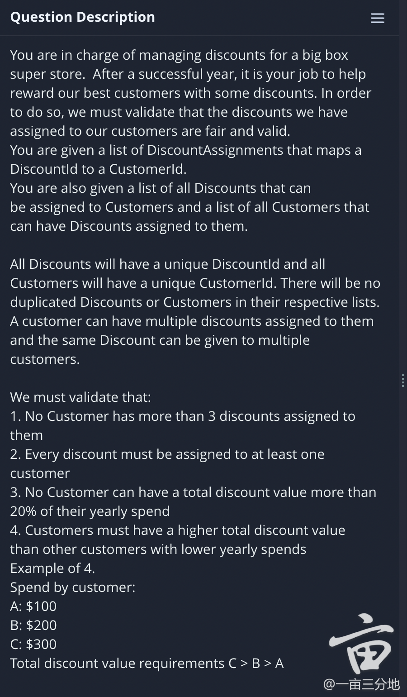

# Discount Validator


Clarification Question
- Is every AssignedDiscount valid? Null?
- discount value: valid? Overflow?
- Customer *Sorted*??
- 

Discussion: 
- https://www.1point3acres.com/bbs/thread-812705-1-1.html
- https://www.1point3acres.com/bbs/thread-823577-1-1.html

怎么测试：
- 几个validation分别测试 -> 怎么写unit test?

```java
import org.junit.jupiter.api.Assertions;
import org.junit.jupiter.api.Test;
class SolutionTest {
    @Test
    public void testFunction() {
        Solution s = new Solution();
        Assertions.assertTrue(s.validateFirst());
    }
}
```

```java
import java.util.Comparator;

class Solution {
    public static void main(String[] args) {
        
    }
    
    public static boolean validateDiscounts(
            List<DiscountAssignment> assignedDiscounts,
            List<Customer> customers,
            List<Discount> discounts
    ) {
        return this.validateFirst() &&
                this.validateSecond() &&
                this.validateThird() &&
                this.validateFourth();
    }

    public boolean validateFourth(List<DiscountAssignment> assignedDiscounts,
                                  List<Customer> customers,
                                  List<Discount> discounts) {
        Collections.sort(assignedDiscounts, new Comparator<Customer>(){
            @override
            public int compare(Customer c1, Customer c2) {
                return c1.getYearlySpend() - c2.getYearlySpend();
            }
        });
        Collections.sort(assignedDiscounts, (c1, c2) -> c1.getYearlySpend() - c2.getYearlySpend());
    }
}


class Customer {
    private int customerId;
    private float yearlySpend;

    public Customer(int customerId, float yearlySpend) {
        this.customerId = customerId;
        this.yearlySpend = yearlySpend;
    }

    public int getCustomerId() {
        return customerId;
    }

    public float getYearlySpend() {
        return yearlySpend;
    }
}

class Discount {
    private int discountId;
    private int productId;
    private float dollarValue;

    public Discount(int discountId, int productId, float value) {
        this.discountId = discountId;
        this.productId = productId;
        this.dollarValue = value;
    }

    public int getDiscountId() {
        return discountId;
    }

    public int getProductId() {
        return productId;
    }

    public float getDollarValue() {
        return dollarValue;
    }
}

class DiscountAssignment {
    private int discountId;
    private int customerId;

    public DiscountAssignment(int discountId, int customerId) {
        this.discountId = discountId;
        this.customerId = customerId;
    }

    public int getDiscountId() {
        return discountId;
    }

    public int getCustomerId() {
        return customerId;
    }
}
```

## How to sort
- https://howtodoinjava.com/java/sort/collections-sort/

### Sort ArrayList of Object by Field
```java
public class Employee implements Comparable<Employee>{

    private Integer id;
    private String name;
    private String email;
    private LocalDate dateOfBirth;

	//Getters and Setters

	@Override
	public int compareTo(Employee e) {
		return this.getName().compareTo(e.getName());
	}
}
```

### Sort by comparator
```java
class Solution {
    public static void main(String[] args) {
        Comparator<Customer> compareBySpend = new Comparator<Customer>() {
            @override
            public int compare(Customer c1, Customer c2) {
                return c1.getYearlySpend() - c2.getYearlySpend();
            }
        };
        
        
    }
}

```


---
